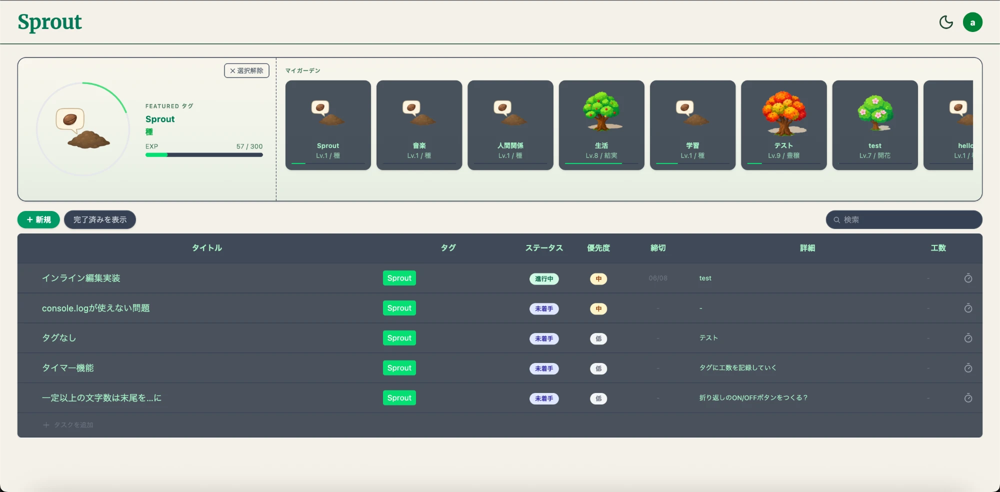
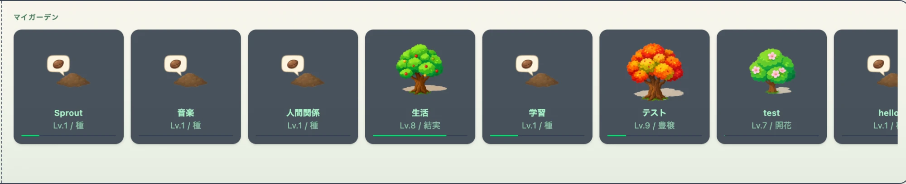
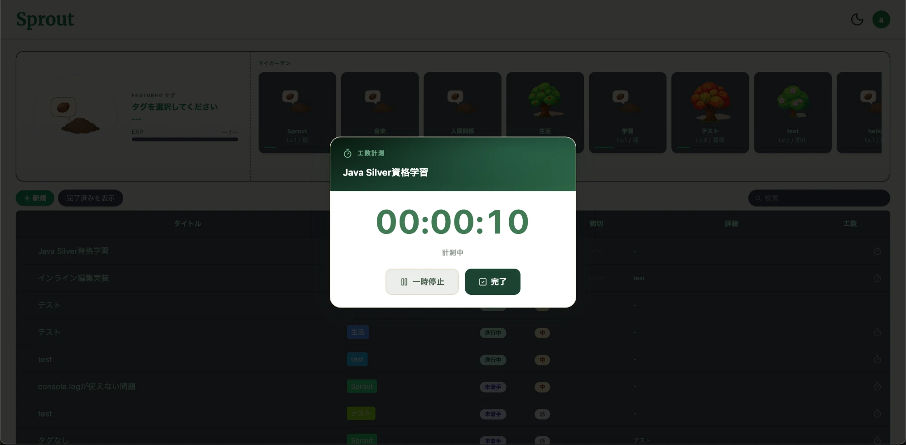
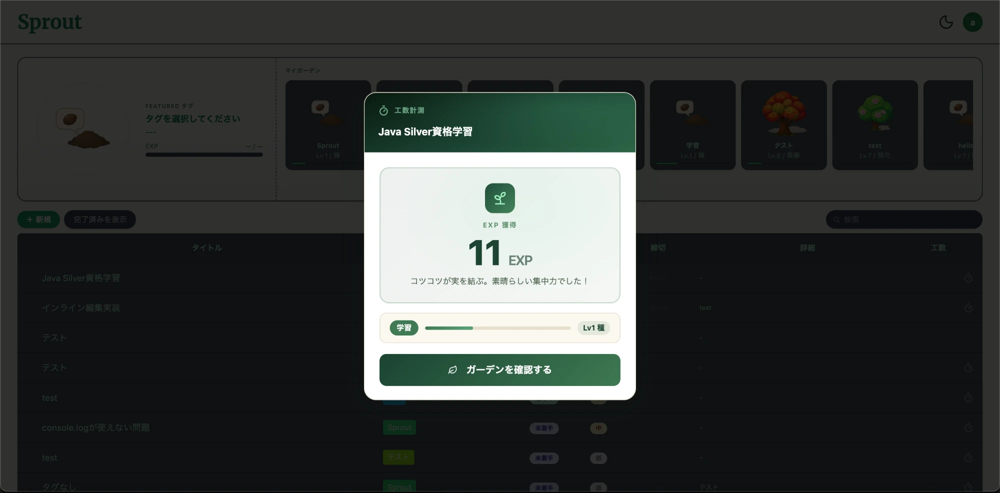
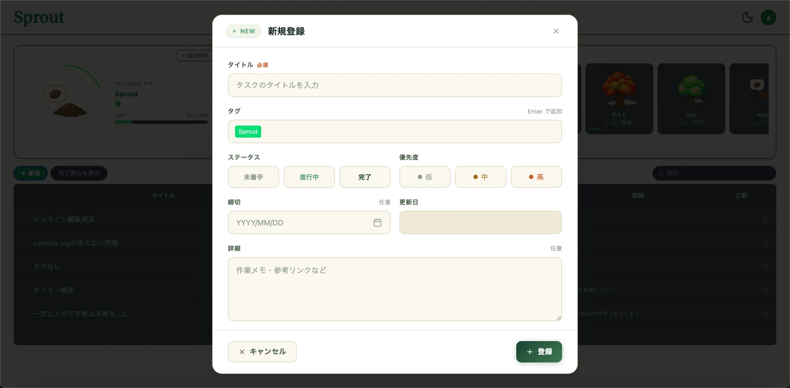
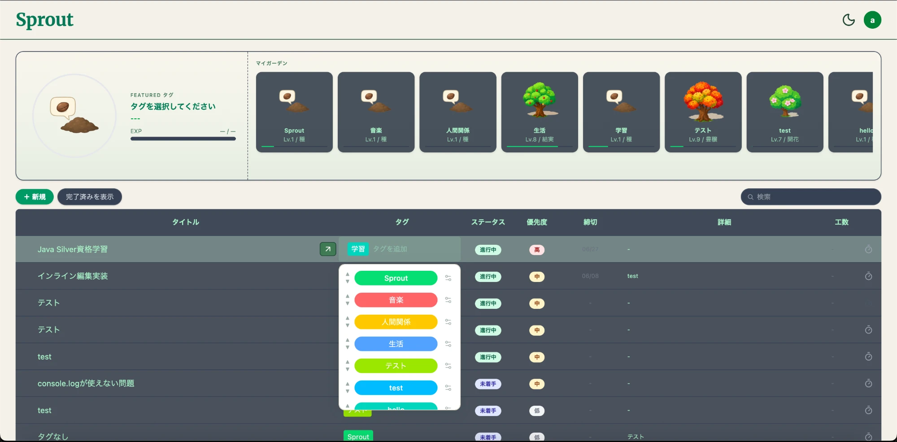
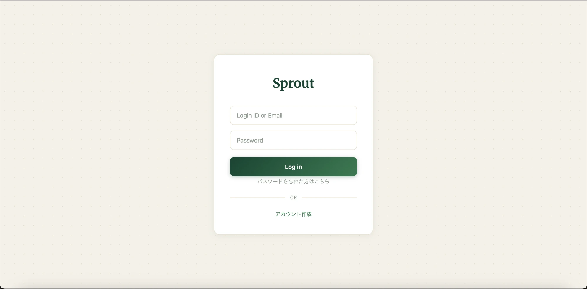
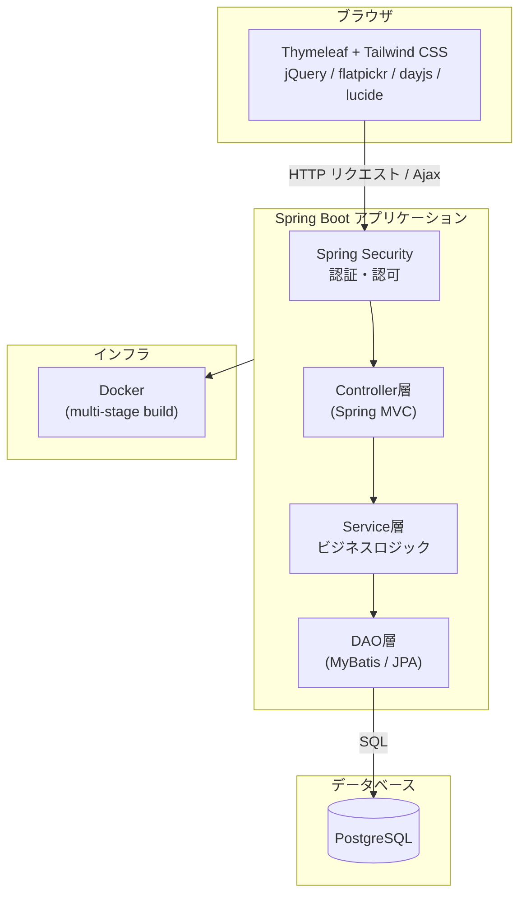

# Sprout — タスクを育てるタスク管理Webアプリ

[](https://openjdk.org/)
[](https://spring.io/projects/spring-boot)
[](https://www.thymeleaf.org/)
[](https://www.postgresql.org/)
[](https://tailwindcss.com/)
[](https://www.docker.com/)

タスクに費やした工数をタグの「EXP」に変換し、タグごとの植物が育っていくタスク管理アプリです。
普通のToDoアプリだけでは続けるモチベーションが保ちにくかったので、続けた分だけ何かが育つ仕組みを自分で作ってみました。
認証、レイヤードアーキテクチャ、フロントエンドの状態管理あたりは実務でも使う構成を意識して組んでいます。

- GitHub Pages（紹介ページ）: https://gono1045.github.io/Sprout/
- デモ環境（Render）: https://sprout-i5mi.onrender.com

---

## スクリーンショット

### トップ画面（マイガーデン・タスク一覧）



左がFeaturedタグ、右がマイガーデン（横スクロール）、下にタスクテーブル。タグの工数が増えるほど、対応する植物が育っていく。

### マイガーデン（タグ別の植物育成）



タグごとに種→芽→苗→…→大樹までステージが分かれていて、それぞれ独立して育つ。

### 工数計測タイマー



タスクの作業時間をその場で計測。一時停止・再開も可能。

### 計測完了からEXP獲得まで



計測を終えるとEXPが入り、LVアップしたタグがあればその場で表示される。

### タスク新規作成



タグ・ステータス・優先度・締切をモーダルでまとめて設定する。

### インライン編集



テーブル上でタグ・ステータス・優先度・締切をクリックしてその場で直す。

### ログイン



---

## システム構成



---

## 技術スタック

| カテゴリ | 技術 | バージョン |
|---|---|---|
| 言語 | Java | 17 |
| フレームワーク | Spring Boot | 3.5.8 |
| テンプレートエンジン | Thymeleaf | 3.x |
| ORM / DB アクセス | Spring Data JPA + MyBatis | MyBatis 3.0.3 |
| データベース | PostgreSQL | Latest |
| 認証・認可 | Spring Security | Boot 管理 |
| フロントCSS | Tailwind CSS | 4.x |
| フロントJS | jQuery / flatpickr / Day.js / Lucide Icons | 各 Latest |
| ビルド | Apache Maven | 3.9.9 |
| コンテナ | Docker (multi-stage build) | — |
| デプロイ先 | Render（Web Service）/ Neon（PostgreSQL） | — |

JPAとMyBatisは用途で分けている。基本的なCRUDはJPAに任せて、複雑なJOINやタグの紐付け更新みたいに細かく制御したいところはMyBatisで書く方針。

### パッケージ構成

```
src/main/java/com/example/sprout/
├── config/       # Security等の設定
├── controller/   # HTTPリクエストの受付
├── dao/          # DBアクセス (MyBatis Mapper)
├── enums/        # 列挙型定義（タグカラー・植物ステージ等）
├── form/         # 入力フォームクラス
├── model/        # エンティティ・DTOクラス
├── security/     # 認証ユーザー詳細・アクセス制御
├── service/      # ビジネスロジック（Interface + Impl）
└── validation/   # カスタムバリデーション
```

---

## 主な機能

| 機能 | 説明 |
|---|---|
| ユーザー認証・アカウント管理 | Spring Security によるログイン・パスワード変更・リセット |
| タスク管理（CRUD） | タスクの作成・編集・削除・複製・完了切り替え。モーダル/テーブル両方から操作可能 |
| インライン編集 | テーブル上でタイトル・タグ・ステータス・優先度・締切・詳細をその場編集 |
| タグ管理 | カラー付きタグでタスクを分類。並び替え・絞り込みフィルターに対応 |
| 工数計測タイマー | タスクごとに作業時間を計測（一時停止・再開対応）、計測結果を作業ログとして記録 |
| EXP / レベルアップシステム | 記録した工数をタグの EXP に変換し、植物（Lv.1 種 〜 Lv.10 大樹）が成長 |
| マイガーデン | タグ別の植物育成状況を一覧表示。Featured タグの詳細進捗も確認可能 |
| アクセス制御 | 他ユーザーのタスク・タグへのアクセスを制御する `AccessControlService` |

---

## この開発で学んだこと・つまったところ

- Spring Securityのカスタム認証フローと`UserDetailsService`の実装。MyBatisの戻り値を`Optional<T>`にすると本番のMyBatisバージョンで起動エラーになったことがあり、ログイン関連のDAOだけは素のSproutUser型に戻している
- 複数のインライン編集UIが同時に開いてしまう問題。クリックした瞬間に他の編集を「Blurされたもの」として確定保存してから新しいセルを開く、という排他制御を自前で書いた
- jQueryのカスタムイベント（`sprout:tags-updated`など）でコンポーネント間をつなぐと、画面のどこからタグを変更してもガーデンの表示が追従するようになる
- `position: fixed`の要素にscroll量を足してしまっていたバグ。fixedはビューポート基準なので、scrollY分だけ位置がズレて画面外に出てしまっていた
- 本番でタスク一覧がなかなか表示されない不具合の原因が、タスク件数分だけタグ取得APIを呼んでいたN+1リクエストだったこと。一括取得用のエンドポイントを1本足して解決した
- ローカルで`mvn compile`が通っていても、target配下のキャッシュが残っているとマージで壊れたコードを検知できない。本番ビルドで初めてコンパイルエラーに気づいたことが何度かあり、それ以降は`mvn clean compile`を必ず通すようにした
- MyBatisしか使わないモデル（タグや工数ログなど）はJPAの`ddl-auto: update`の対象にならないので、本番DBにテーブルやカラムが作られないまま気づかず動かしていた

---

## ローカル開発環境

### 前提条件

- Java 17 / Maven
- Node.js / npm（Tailwind ビルド用）
- PostgreSQL（DB名: `sprout`）

### 起動手順

```bash
# 1. Tailwind CSS のビルド（変更監視）
npm run watch:css

# 2. Spring Boot 起動（local プロファイル）
./mvnw spring-boot:run -Dspring-boot.run.profiles=local
```

`spring.jpa.hibernate.ddl-auto: update`を使っているが、これはJPAエンティティにしか効かない。MyBatis専用テーブルはマイグレーションSQLを手動で流す必要がある（このプロジェクトでは今後改善したい点のひとつ）。

---

## Author

[@gono1045](https://github.com/gono1045)
