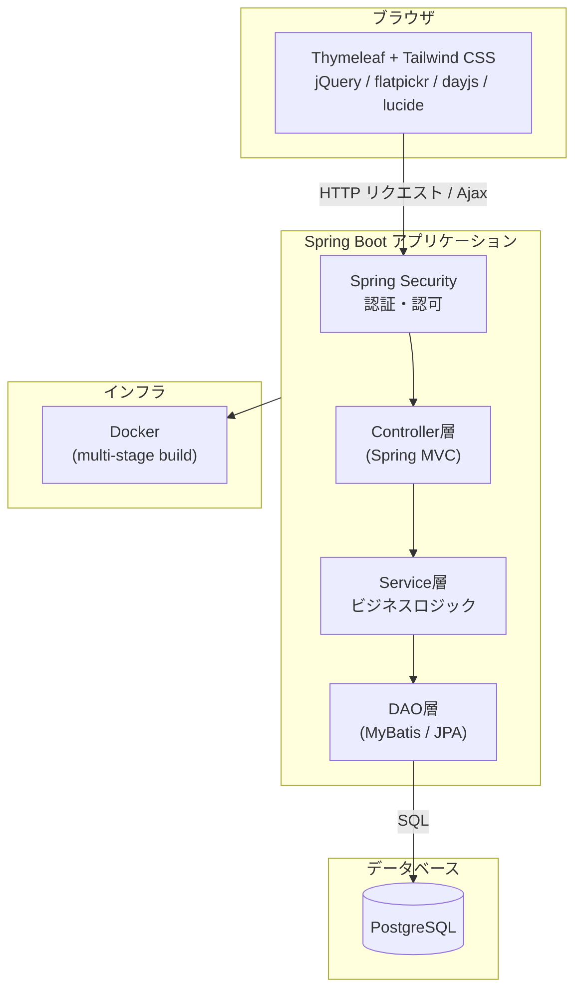

# 🌱 Sprout — タスクを育てるタスク管理Webアプリ

[](https://openjdk.org/)
[](https://spring.io/projects/spring-boot)
[](https://www.thymeleaf.org/)
[](https://www.postgresql.org/)
[](https://tailwindcss.com/)
[](https://www.docker.com/)

タスクに費やした工数を「EXP」として植物に与え、タスクをこなすほど植物が育っていく、
ゲーミフィケーション要素を取り入れたタスク管理Webアプリです。
個人学習の集大成として、認証・レイヤードアーキテクチャ・DBアクセス・フロントエンドの状態管理など、
実務に近い技術を組み合わせて開発しました。

▶ **GitHub Pages（紹介ページ）**: https://gono1045.github.io/Sprout/
▶ **デモ環境（Render）**: 準備中

---

## 📸 スクリーンショット

### トップ画面（マイガーデン・タスク一覧）


Featured タグ（左）・マイガーデン（右、横スクロール対応）・タスクテーブルを1画面に集約。
タスクに紐づくタグの工数が増えるほど、対応する植物が成長します。

### マイガーデン（タグ別の植物育成）


タグごとに植物のステージ（種 → 芽 → 苗 → … → 大樹）が独立して育ちます。

### 工数計測タイマー


タスクの作業時間をその場で計測。一時停止・再開にも対応。

### 計測完了 → EXP獲得


計測終了後、達成感を演出するアニメーションでEXP獲得・LVアップを通知します。

### タスク新規作成


タグ・ステータス・優先度・締切などをモーダルで一括設定。

### インライン編集


テーブル上でタグ・ステータス・優先度・締切などをクリックしてその場で編集可能。

### ログイン


---

## 🏗️ システム構成図



---

## 🛠️ 技術スタック

| カテゴリ | 技術 | バージョン |
|---|---|---|
| 言語 | Java | 17 |
| フレームワーク | Spring Boot | 3.5.8 |
| テンプレートエンジン | Thymeleaf | 3.x |
| ORM / DB アクセス | Spring Data JPA + MyBatis | MyBatis 3.0.3 |
| データベース | PostgreSQL | Latest |
| 認証・認可 | Spring Security | Boot 管理 |
| フロントCSS | Tailwind CSS | 4.x |
| フロントJS | jQuery / flatpickr / Day.js / Lucide Icons | 各 Latest |
| ビルド | Apache Maven | 3.9.9 |
| コンテナ | Docker (multi-stage build) | — |

### パッケージ構成

```
src/main/java/com/example/sprout/
├── config/       # Security等の設定
├── controller/   # HTTPリクエストの受付
├── dao/          # DBアクセス (MyBatis Mapper)
├── enums/        # 列挙型定義（タグカラー・植物ステージ等）
├── form/         # 入力フォームクラス
├── model/        # エンティティ・DTOクラス
├── security/     # 認証ユーザー詳細・アクセス制御
├── service/      # ビジネスロジック（Interface + Impl）
└── validation/   # カスタムバリデーション
```

---

## ✨ 主な機能

| 機能 | 説明 |
|---|---|
| ユーザー認証・アカウント管理 | Spring Security によるログイン・パスワード変更・リセット |
| タスク管理（CRUD） | タスクの作成・編集・削除・複製・完了切り替え。モーダル/テーブル両方から操作可能 |
| インライン編集 | テーブル上でタイトル・タグ・ステータス・優先度・締切・詳細をその場編集 |
| タグ管理 | カラー付きタグでタスクを分類。並び替え・絞り込みフィルターに対応 |
| 工数計測タイマー | タスクごとに作業時間を計測（一時停止・再開対応）、計測結果を作業ログとして記録 |
| EXP / レベルアップシステム | 記録した工数をタグの EXP に変換し、植物（Lv.1 種 〜 Lv.10 大樹）が成長 |
| マイガーデン | タグ別の植物育成状況を一覧表示。Featured タグの詳細進捗も確認可能 |
| アクセス制御 | 他ユーザーのタスク・タグへのアクセスを制御する `AccessControlService` |

---

## 💡 この開発で学んだこと

- Spring Security のカスタム認証フローと `UserDetailsService` 実装
- JPA と MyBatis の使い分け（基本CRUDはJPA、複雑なJOIN・動的更新はMyBatis）
- レイヤードアーキテクチャ（Controller → Service Interface + Impl → DAO）
- フロントエンドの状態管理：複数のインライン編集コンポーネントが競合しないよう、
  「編集中の項目を Blur 相当で確定保存してから次を開く」仕組みを自前で実装
- jQuery カスタムイベント（`sprout:tags-updated` / `sprout:task-updated`）による
  コンポーネント間の疎結合な状態同期
- `position: fixed` のドロップダウンUIにおける scroll 量の扱い（viewport基準であることに起因するバグの調査・修正）
- `@RequestParam` の空配列送信時の挙動（jQuery `traditional: true` の落とし穴）
- Enum による定数の一元管理（`SproutStage` でLv閾値・ステージ名を集約）
- Tailwind CSS 4.x を npm ビルドで組み込むフロントエンド構成
- Docker を使ったコンテナ化とデプロイ準備

---

## 🚀 ローカル開発環境

### 前提条件

- Java 17 / Maven
- Node.js / npm（Tailwind ビルド用）
- PostgreSQL（DB名: `sprout`）

### 起動手順

```bash
# 1. Tailwind CSS のビルド（変更監視）
npm run watch:css

# 2. Spring Boot 起動（local プロファイル）
./mvnw spring-boot:run -Dspring-boot.run.profiles=local
```

`spring.jpa.hibernate.ddl-auto: update` を使用しており、スキーマは JPA Entity から自動更新されます。

---

## 👤 Author

[@gono1045](https://github.com/gono1045)
