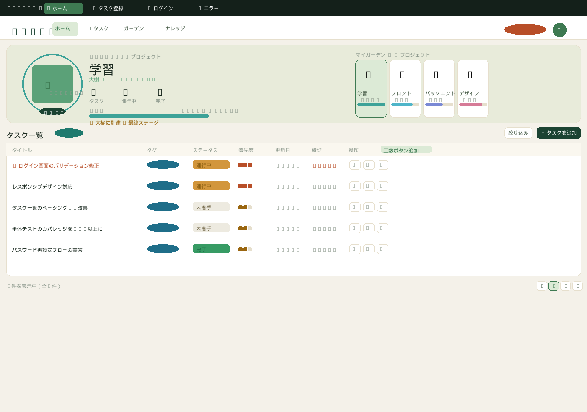
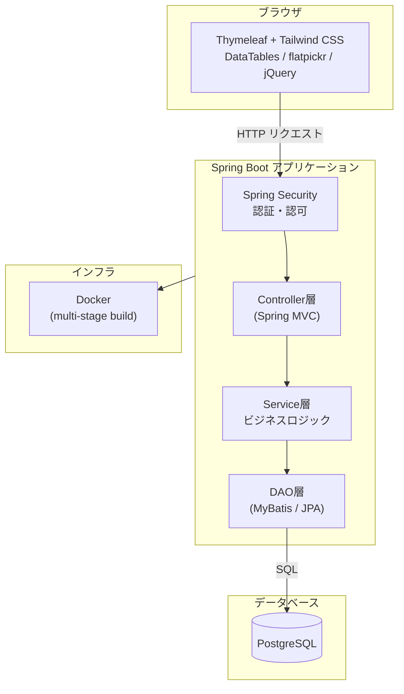

# 🌱 Sprout — タスク管理アプリ

[](https://openjdk.org/)
[](https://spring.io/projects/spring-boot)
[](https://www.thymeleaf.org/)
[](https://www.postgresql.org/)
[](https://tailwindcss.com/)
[](https://www.docker.com/)

植物の成長をモチーフにした、シンプルで使いやすいタスク管理Webアプリです。
タスクの進捗に応じて植物が育つビジュアルフィードバックが特徴です。

---

## 📸 デモ

> ※ スクリーンショット・操作GIFをここに追加してください
> `docs/images/` フォルダに画像を配置し、以下のように参照します

```md

```

---

## 🏗️ システム構成図



---

## 🛠️ 技術スタック

| カテゴリ | 技術 | バージョン |
|---|---|---|
| 言語 | Java | 17 |
| フレームワーク | Spring Boot | 3.5.8 |
| テンプレートエンジン | Thymeleaf | 3.x |
| ORM / DB アクセス | Spring Data JPA + MyBatis | MyBatis 3.0.4 |
| データベース | PostgreSQL | Latest |
| 認証・認可 | Spring Security | Boot 管理 |
| フロントCSS | Tailwind CSS | 3.x |
| フロントJS | jQuery / DataTables / flatpickr / Day.js | 各 Latest |
| ビルド | Apache Maven | 3.9.9 |
| コンテナ | Docker (multi-stage build) | — |

### パッケージ構成

```
src/main/java/com/example/sprout/
├── config/       # Security等の設定
├── controller/   # HTTPリクエストの受付
├── dao/          # DBアクセス (MyBatis Mapper)
├── enums/        # 列挙型定義
├── form/         # 入力フォームクラス
├── model/        # エンティティ・DTOクラス
├── security/     # 認証ユーザー詳細
├── service/      # ビジネスロジック
└── validation/   # カスタムバリデーション
```

---

## ✨ 主な機能

| 機能 | 説明 |
|---|---|
| タスク管理 | タスクの登録・編集・削除・完了管理 |
| タスク検索 | 内容キーワードによるリアルタイム絞り込み |
| 完了済み表示切替 | 完了タスクの表示/非表示を切り替え |
| タグ機能 | カラータグによるタスクの分類 |
| 植物育成ビジュアル | タスクの進捗に応じて植物が成長するカルーセル表示 |
| ユーザー管理 | ユーザー登録・ログイン・ログアウト（Spring Security） |

---

## 🚀 ローカル環境構築

### 前提条件

| ツール | バージョン |
|---|---|
| JDK | 17 以上 |
| Apache Maven | 3.9.x 以上 |
| PostgreSQL | 14 以上 |
| Node.js / npm | Tailwind CSS ビルド用 |

### 手順

#### 1. リポジトリのクローン

```bash
git clone https://github.com/gono1045/sprout.git
cd sprout
```

#### 2. データベースの作成

```sql
-- PostgreSQL に接続後
CREATE DATABASE sprout;
CREATE USER sprout_user WITH PASSWORD 'your_password';
GRANT ALL PRIVILEGES ON DATABASE sprout TO sprout_user;
```

#### 3. アプリケーション設定

`src/main/resources/application-local.yml` を作成し、DB接続情報を記載します。

```yaml
spring:
  datasource:
    url: jdbc:postgresql://localhost:5432/sprout
    username: sprout_user
    password: your_password
  jpa:
    hibernate:
      ddl-auto: update
```

> ⚠️ `application-local.yml` は `.gitignore` で除外されています。リポジトリには含めないでください。

#### 4. Tailwind CSS のビルド

```bash
npm install
npm run build
```

#### 5. アプリケーションの起動

```bash
mvn spring-boot:run -Dspring-boot.run.profiles=local
```

#### 6. 動作確認

ブラウザで http://localhost:8080 を開く

---

### Docker を使って起動する場合

```bash
docker build -t sprout .
docker run -p 8080:8080 \
  -e SPRING_DATASOURCE_URL=jdbc:postgresql://host.docker.internal:5432/sprout \
  -e SPRING_DATASOURCE_USERNAME=sprout_user \
  -e SPRING_DATASOURCE_PASSWORD=your_password \
  sprout
```

---

## 📝 このアプリで学んだこと

> ※ 開発を通じて得た知見・苦労した点・工夫したポイントを記載してください

```
例：
- Spring Security のカスタム認証フロー実装
- MyBatis と JPA の使い分けの判断基準
- Thymeleaf フラグメントを活用したテンプレート共通化
- Tailwind CSS の purge 設定でビルドサイズを最適化
```

---

## 📄 ライセンス

This project is for portfolio purposes.
